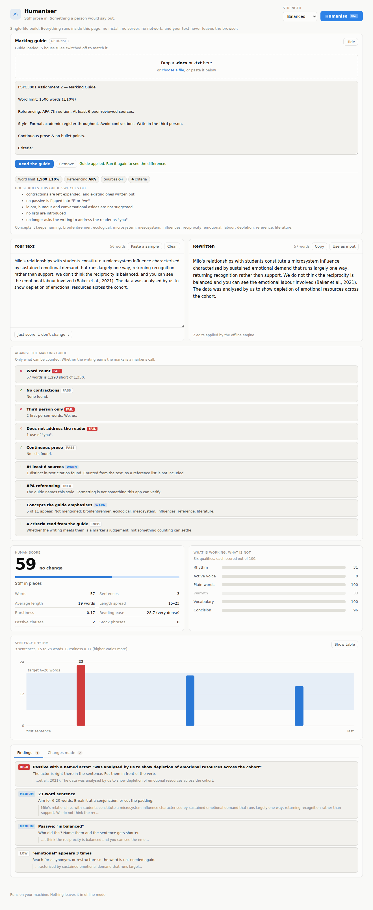
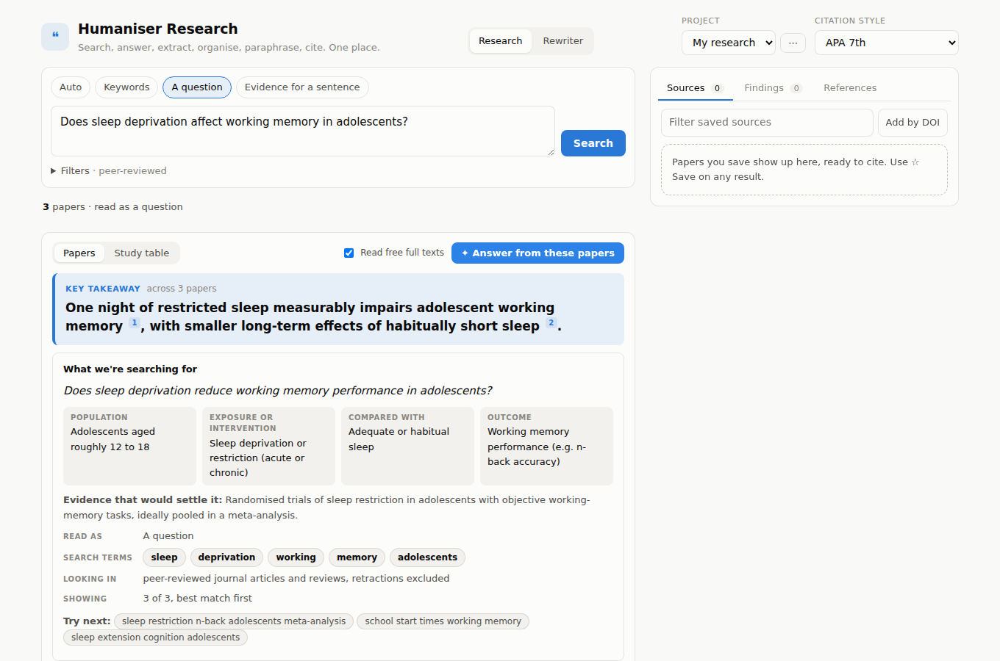

# Humaniser

A research assistant and a rewriter in one page. Ask a question and get peer-reviewed papers, a key takeaway, a breakdown of exactly what the question is asking, a cited answer with a consensus meter read from the papers' full texts where they are free, and a table of study designs, samples and findings. Save what matters, paraphrase it with the overlap shown, cite it in six styles, then write it up and smooth the prose, all without leaving the page.

The rewriter half does what it always did: paste writing that sounds like a committee produced it, and get back something a person would say.

Humaniser runs as a small local web app on macOS or Linux. It scores your text against a house style, shows you exactly where the prose stiffens, and rewrites it two ways: with an offline rules engine that needs no account and no network, or with Claude when you want real judgement applied to rhythm and metaphor.

**No API key required.** The offline engine is the default and it needs nothing — no account, no key, no network. Claude is an optional extra for people who already have API access.


Dark mode comes along for free, following whatever your Mac is set to: [see it](docs/screenshot-dark.png).

## The quickest way in: one file, nothing to install

Download **[humaniser.html](humaniser.html)** and double-click it.

That is the whole thing. No Node, no terminal, no server, no account. The rewriter's rules engine, the scoring, the charts and the findings are all inside that one file, running in your browser, and your draft never leaves the page. Research is in there too: it searches OpenAlex straight from the page, so it needs an internet connection, and the only things it sends are your search terms.

It gives you everything except the AI features (the cited answer, AI paraphrasing and the model rewrite), which need a server to hold the API key, and full-text PDF reading, which needs the server to fetch and read the PDFs. If you have no key, you lose nothing at all. Marking guides work in it too, `.docx` included: the zip is unpacked in the page.

On a Mac you may see a warning the first time, since the file came from the internet. Right-click it and choose **Open With → your browser** and it will open normally.

## The full version, with Node

Worth it if you want the Claude engine, or you plan to change the code. Everything below is about that version.

Node 18 or newer is the only thing you need, and macOS does not come with it. Check whether you already have it:

```bash
node -v
```

A version number means you are set. "command not found" means you need it, so pick one of these.

**macOS, no terminal required.** Go to [nodejs.org](https://nodejs.org), download the macOS installer for the LTS version, and double-click it. It is a small, ordinary `.pkg` — next, next, done. This is the path to take if you do not already use Homebrew, because Homebrew itself wants Xcode's command line tools first, which is a far bigger download than Node.

**macOS, if you already have [Homebrew](https://brew.sh):**

```bash
brew install node
```

**Ubuntu and other Debian-based Linux.** The version in `apt` is often too old, so check it after installing:

```bash
sudo apt update && sudo apt install -y nodejs npm git
node -v
```

If that shows anything below 18, use [nvm](https://github.com/nvm-sh/nvm), which does not need root and does not fight your package manager:

```bash
curl -o- https://raw.githubusercontent.com/nvm-sh/nvm/v0.40.1/install.sh | bash
exec $SHELL
nvm install 22
node -v
```

Nothing here needs Node 20 or a build toolchain. The app has two dependencies and no native modules, so there is nothing to compile.

Whichever route you took, close the terminal afterwards and open a fresh one, so the new `node` command is on your path. Then:

```bash
git clone https://github.com/AdilKhan1113/Humaniser.git
cd Humaniser
./start.sh
```

That installs the two dependencies, starts the server and opens your browser at `http://127.0.0.1:8787`. On Linux it opens through `xdg-open`; if your box has no desktop session it just prints the address for you to open yourself. The first run takes a few seconds. Every run after that is instant.

Prefer to do it by hand? `npm install && npm start` does the same thing without opening a browser.

To regenerate the single-file build after changing anything under `lib/` or `public/`:

```bash
npm run build
```

Cloning a *private* fork is the one case that needs more: GitHub has not accepted account passwords for Git since 2021, so run `gh auth login` first, or use a [personal access token](https://github.com/settings/tokens) with the `repo` scope in place of the password.

### Optional: turn on model rewriting

Skip this unless you have an API key. Without one the model option stays greyed out and everything else works as normal.

Either provider works, and **whichever key you set decides which one is used**. Copy the example file:

```bash
cp .env.example .env
```

For **Gemini**, paste a key from [Google AI Studio](https://aistudio.google.com/apikey):

```
GEMINI_API_KEY=AIza...
```

For **Claude**, paste one from [the Anthropic console](https://console.anthropic.com/settings/keys) instead:

```
ANTHROPIC_API_KEY=sk-ant-...
```

Restart the server. It prints which provider it picked, and the Engine menu changes to match. Set both keys and `HUMANISER_PROVIDER=gemini` or `=anthropic` chooses.

Note that a key is not the same thing as a Gemini or Claude subscription. Keys come from the developer consoles above and are billed per use, and Google's free tier is generous enough that light use often costs nothing.

**Which model?** The default is each provider's `-latest` alias, so it never points at a retired version. To see exactly what your key can reach:

```bash
curl -s localhost:8787/api/models | python3 -m json.tool
```

Then set `GEMINI_MODEL` to whichever you want.

The control next to Strength changes meaning with the provider, and the app labels it accordingly. On Claude it is **Thinking**, which sets reasoning depth. On Gemini it is **Variation**, which sets sampling temperature — higher means more varied phrasing, which is most of what sentence rhythm is.

## How to use it

Paste your text on the left and press **Humanise**, or hit `⌘↵`. Three things then happen.

The rewrite appears on the right, streaming in as Claude writes it. A score out of 100 tells you how human the result reads, with the change from your original beside it. Below that sits the detail: six qualities scored separately, a chart of every sentence's length, a list of what is still wrong, and a list of every edit that was made.

Click any finding and it selects that exact phrase in your text. Click a bar in the chart and it jumps to that sentence.

**Strength** decides how far to go.

| Setting | What it touches |
| --- | --- |
| Light touch | Only the uncontroversial: stock phrases, inflated words, the comma rule |
| Balanced | The full style — active voice, shorter sentences, contractions, no padding |
| Bold | Same rules, harder. Shorter sentences, contractions wherever they fit |

**Thinking** appears in Claude mode and sets how hard the model works. Low is fast and surprisingly good. High is the default. Very high is for prose you really care about.

## Feeding it a marking guide



Open **Marking guide**, then drop in your rubric or paste it. It reads `.docx` and plain text. PDFs it cannot read — no parser fits in a single file — so open the PDF, select all, copy, and paste.

What it takes from the guide:

| Read from the guide | What it does with it |
| --- | --- |
| Word limit, including `±10%` | Counts your draft against it |
| "Avoid contractions" | Stops adding them, and writes the ones you have out in full |
| "Write in the third person" | Stops turning passives into "we", and flags the first person you already have |
| "Formal academic register" | Implies the two above, and drops warmth from the score |
| "Continuous prose" | Checks for lists |
| APA, Harvard, MLA and the rest | Counts your in-text citations against any stated minimum |
| The concepts it keeps naming | Tells you which ones your draft never mentions |
| Its criteria lines | Shows them back to you, and says plainly that meeting them is a marker's call |

The part worth having is the conflict handling. Marking guides routinely demand the opposite of this app's house style — no contractions, third person only, formal register — and without the guide the rewriter would push your essay **away** from what it is marked against. With the guide loaded, the panel lists exactly which house rules it switched off, and the score stops penalising formal writing for being formal.

What a guide cannot do offline is satisfy a criterion. "Evaluates critically" and "demonstrates understanding" are judgements, and no amount of counting reaches them. The app says so rather than pretending. In Claude mode the guide goes into the prompt as binding instructions, which does reach the register and the phrasing, though still never the content: neither engine will invent a source or an argument to tick a box.

## The two engines, and why you would pick one

The **offline rules engine** is a set of transforms with a strict promise: when it cannot be certain, it does nothing. It flips "the cake was eaten by the dog" to "the dog ate the cake" because every piece of that is checkable. It refuses to flip "the window was broken" because nobody said who broke it, so it flags the sentence instead. Nothing leaves your machine, it costs nothing, and it finishes before you lift your finger off the key. What it cannot do is write. It swaps words and shuffles clauses; it will never think of a better metaphor.

The **model engine** rewrites properly. It varies sentence structure, reaches for a concrete example, and hears when a paragraph plods. It costs money per use and sends your text to whichever API you configured. Use the offline engine for a quick clean-up and the model when the writing matters.

A useful habit: run the offline engine first to see the mechanical problems listed out, then run the model on the original.

## What the score measures

The headline number is a weighted blend of six qualities, each scored out of 100.

- **Rhythm** — how much sentence lengths vary. Machines write at one speed.
- **Active voice** — the share of sentences that name who is doing the thing.
- **Plain words** — freedom from stock phrases and corporate inflation.
- **Warmth** — contractions, and whether the writing ever addresses you.
- **Vocabulary** — range of words, and how often phrasing repeats.
- **Concision** — sentence length against the 6-to-20-word target, minus the padding.

Two of the numbers deserve a word of explanation, because they are named after ideas from language modelling and only approximate them.

**Burstiness** is honest: it is the coefficient of variation of sentence lengths, which is exactly what the term means. Higher is more varied. Below about 0.30 the writing reads like a metronome.

**Vocabulary** is a *proxy* for perplexity, not perplexity itself. Real perplexity needs a language model scoring every token. This score instead combines the type-token ratio, the share of words outside a common-word list, and how often word pairs repeat. It correlates with what perplexity captures, but do not read it as the same measurement. Short passages also inflate it, since a forty-word note can hardly repeat itself.

## The house style

Both engines work from the same rules.

Active voice over passive. Sentences of varied shape and varied length, mostly between 6 and 20 words. Plain words where a plain word will do. Contractions, but not wall to wall. Speak to the reader as "you". Concrete examples and analogies over another abstract sentence. Natural transitions like "However" or "For example". No padding, no self-references, no essay scaffolding, no lecturing.

One mechanical rule is worth stating plainly, because it surprises people: **no comma before and, but, for, or, nor, so, yet when both sides could stand alone as sentences.** So "I read the book but I disliked it", not "I read the book, but I disliked it". Lists keep their commas, and a comma stays when what follows cannot stand alone.

There is a tension inside these rules and it is deliberate. The style asks for simpler words *and* for uncommon terminology. Those pull in opposite directions, so Humaniser resolves it one way: **corporate padding goes, vivid precision stays.** "Utilize" becomes "use" every time. A word like "cantankerous" is left exactly where it is, because it is doing work no common word could do.

## What it will not do

It will not invent facts. Neither engine adds an example, a statistic or an anecdote that was not in your text, and the Claude prompt forbids it explicitly. If your draft is thin, the rewrite is thin — tighter, but thin.

It will not touch code. Fenced blocks, inline code, URLs, markdown links and email addresses are all masked before any rule runs and restored untouched afterwards.

It will not guess at grammar. English participles are irregular enough that a confident rewrite is often a wrong one, so the rewriter checks a verb table first and declines when the verb is unfamiliar in that tense. A missed fix shows up as a finding. A wrong fix would show up as a sentence you have to untangle, which is worse.

It is not a detector. A high score means the writing reads naturally. It is not a claim about what any particular detection tool will say, and the app never pretends otherwise.

## The research workspace

Research is the first thing you see; **Rewriter** is the other tab in the top bar. It covers the whole path of writing from sources: finding the papers, reading across them, keeping track of what they say, putting it in your own words, citing it properly, and writing it up.



**Search with whatever you have.** A topic (`microplastics freshwater`), a question (`Does sleep deprivation affect working memory in adolescents?`), a claim lifted from your draft, or a DOI. Questions and sentences are mostly glue words, which full-text search ranks badly, so the app pulls out the content words and shows you what it actually searched for. For a question or a claim, each result also shows the abstract sentences that match, so you can see the supporting line without opening the paper.

The index is [OpenAlex](https://openalex.org): more than 250 million scholarly works, free, with citation counts, venues and open-access links. By default you only see **peer-reviewed journal articles and reviews with a DOI**, retracted papers excluded. Turn that off to include books, conference papers and preprints, which are labelled as such. Filter by year, by citation count, or to papers that are free to read, and sort by best match, most cited or newest.

**Key takeaway, first.** Above everything else sits one sentence: the most important point. Before you ask the AI, it is the finding of the strongest study in the results, with its design and citation count, so a meta-analysis outranks a single survey. After an answer, it is the AI's one-line takeaway across all the papers, with each claim linked to its paper.

**What we're searching for.** Under the takeaway, a panel spells out what the search is actually looking for: the terms it sent, how it read your input, which kinds of publication it is searching and how the results are ordered. After an answer, the AI breaks the question into its parts: population, exposure or intervention, comparison and outcome, or topic and context for questions that are not about an effect. It adds the kind of evidence that would settle the question and two or three follow-up searches you can run with one click.

**Read the full text, not just the abstract.** **Read full text** on a paper finds its free PDF and reads it: the copy the publisher, a repository or a preprint server holds, following a repository's landing page to its PDF where needed. The paper opens in sections (abstract, methods, results, discussion, conclusion), the reference list removed, and every paragraph shows its page. Click any sentence to paraphrase or quote it, and the page number goes into the citation. It is the printed journal page when the index knows the page range, so page 2 of the PDF of a paper on pages 112–120 is cited as p. 113. For a paper with no free copy, **upload the PDF** you got through your library. It is read and discarded, never stored.

**Get an answer across the papers.** Press **Answer from these papers** and the AI reads the top twelve papers and writes a short answer in which every claim links to the paper behind it. With **Read free full texts** ticked, which is the default, it first fetches the free PDFs and reads their methods, results and discussion instead of the abstract, and says how many it managed. Full texts you opened or uploaded are always used. For a yes-or-no question, a consensus meter shows how many papers say yes, possibly or no. It works only from the abstracts it was given, and it says so, and a citation to a paper it was not given is stripped rather than shown. Copy the answer with real in-text citations in your chosen style, or save it as a finding.

**See the studies side by side.** Switch to **Study table** for one row per paper: design, sample, population and key finding. Sort by strength of evidence (meta-analyses and trials first), sample size, citations or date, and export it as CSV. Without an AI key, the table is filled by pattern matching on the abstract, which catches the common designs and sample sizes and says "not stated" rather than guess. Rows for papers whose full text you have opened are read from the methods and conclusion instead, and each row says which it came from. After an answer, the AI's reading fills the gaps, marked ✦, adds the limitation each paper admits to, and a column shows each paper's stance.

**Follow the trail.** Every paper has three buttons. **Related** shows OpenAlex's similar works. **Cited by** shows newer papers that built on it. **References** shows what it built on.

**Organise as you go.** Save papers to **Sources** and tag them. Then collect **Findings**: quotes, paraphrases and your own notes. Sort them into themes, which can be arguments or the sections of your paper, and drag them between themes. Every finding keeps its source, so its citation is always one click away. **Export outline** writes the themes out as Markdown, each finding already cited and the reference list at the bottom. Projects are separate, one per paper or chapter.

**Paraphrase with the overlap shown.** Open a paper's abstract and click any sentence to paraphrase it, quote it, or search for other papers that say the same thing. The paraphraser gives you three versions to write over. The offline engine moves the attribution ("We found that X" becomes "X, as the authors found"), swaps reporting verbs and stock academic phrases, fronts subordinate clauses, and flips simple passives. The model engine, when a key is set, does the part that needs judgement. Numbers, statistics and technical terms are left alone either way.

Every version, including your edits as you type, is checked against the source:

| Shows | Means |
| --- | --- |
| Your own words | Different in wording and structure. Keep the citation |
| Close to the source | A run of five or more words survived, or a quarter of the three-word sequences did. Change the structure, not just the words |
| Too close | Seven words in a row, or nearly half the sequences. Rework it, or quote it with a page number |

This is not a plagiarism checker and it does not claim to be one. It tells you whether the wording is still the author's, which is the thing you need to know before the sentence goes into your draft. A paraphrase still needs a citation, and the app always attaches one.

**Polish, write up, and go back for more.** Any paraphrase can be **polished** by the rewriter's engine under academic rules: no contractions, no "we", no "you". **Write up** on a theme sends its findings, citations attached, to the rewriter as a paragraph, with a marking guide for formal academic writing already filled in. Going the other way, **Find sources** in the rewriter takes the sentence under your cursor and searches for papers that support it.

**Cite in six styles:** APA 7th, MLA 9th, Chicago author-date, Harvard, IEEE and Vancouver. For any paper you get the reference-list entry, the in-text citation for the end of a sentence (`(Okafor et al., 2019, p. 114)`), and the narrative form for when the authors are named in the sentence (`Okafor et al. (2019)`). Add a page or a range and it is formatted the way the style wants. Two papers by the same authors in the same year become 2019a and 2019b. Numeric styles number sources in the order you saved them. The **References** tab builds the whole list and updates when you change style. Copy it, or download it as BibTeX or RIS for Zotero, Mendeley, EndNote or Overleaf.

Your projects stay in the browser. What leaves it is your search terms, and the passage you paraphrase if you pick the model engine. **Back up** from the project menu writes a `.json` file, and **Restore** reads it back on any machine.

Citation data is only as good as the index. Titles sometimes arrive in capitals and issue numbers go missing, so check the final list against your style guide. To get faster, more reliable answers from OpenAlex, set `SCHOLAR_EMAIL` in `.env`. The address is sent with each request to OpenAlex and Crossref, the way both ask.

### Turning on the AI features with Gemini

The cited answer, AI paraphrasing and the model rewrite all use whichever key the server has. For Gemini, get a key from [Google AI Studio](https://aistudio.google.com/apikey), then in the project folder:

```bash
cp .env.example .env
```

Open `.env` in any text editor, put the key after `GEMINI_API_KEY=`, save, and restart with `npm start`. The status line under the rewriter's top bar says "Gemini is ready" when it has worked. Keep the key in `.env` only: that file is ignored by git, so it never ends up on GitHub.

## Project layout

```
humaniser.html       The generated single-file build. Do not edit: run npm run build
server.js            HTTP server, routes, streaming. No framework.
Dockerfile           Production image, non-root, health-checked
render.yaml          Render blueprint
fly.toml             Fly.io configuration
lib/
  analyze.js         Scoring, metrics and every finding in the report
  rules.js           The offline rewriter and its pipeline
  passive.js         Passive detection and the active-voice flip
  verbs.js           Verb tables, so a flip does not invent a tense
  lexicon.js         Word lists: stock phrases, inflated words, contractions
  common-words.js    Frequency list, for the rare-word share and name detection
  rubric.js          Reads a marking guide and checks a draft against it
  docx.js            Unzips a .docx to plain text, with no dependency
  prompt.js          The house style, written for a model. Provider agnostic
  provider.js        Picks a provider from whichever key is set
  providers/
    gemini.js        Gemini over its REST API, no SDK needed
    anthropic.js     Claude via the official SDK
  guard.js           Rate limiting and the access code, for a public deployment
  scholar.js         OpenAlex and Crossref search, normalised to one record shape
  keywords.js        Turns a question or a sentence into a search
  cite.js            Six citation styles, BibTeX and RIS. Also runs in the browser
  paraphrase.js      The offline paraphraser, and the model prompt for one
  overlap.js         How close a paraphrase is to its source. Also runs in the browser
  insights.js        The study table, the takeaway, and the prompt and parser for the cited answer
  fulltext.js        Finds a free PDF safely and reads it into sections with page numbers
  sentences.js       Sentence splitting that survives "et al." and "0.62"
  env.js             Reads .env without needing a newer Node
public/              The front end: one page, app.js for the rewriter, research.js for Research
tools/
  build-standalone.js Inlines lib/ and public/ into humaniser.html
test/                158 tests, run with npm test
```

`public/app.js` serves both builds. With a server it calls `/api`; in the single-file build it finds an injected bridge and calls the rules engine directly, so there is one front end rather than two copies drifting apart. A test fails if `humaniser.html` falls behind its sources.

There is no build step. No bundler, no transpiler, no framework. `public/app.js` is the file the browser runs, which means you can change a line and just reload.

## Putting it online

The app is a plain Node server with two dependencies (the Anthropic SDK, and PDF.js for reading PDFs), a health check at `/healthz`, and every secret read from the environment. That deploys anywhere. Two routes are set up ready to go.

### Before you expose it: protect the key

Your API key lives on the server, so **anyone who can reach the URL can spend your credit**. Set an access code and Claude mode asks for it:

```bash
HUMANISER_ACCESS_CODE=pick-something-long
```

The offline engine stays open to everyone, because it costs nothing and sends nothing anywhere. On startup the server prints a warning if a key is set without a code, and it will not let a wrong code eat into your hourly allowance.

| Variable | What it does | Default |
| --- | --- | --- |
| `GEMINI_API_KEY` | Turns on model rewriting with Gemini | unset, offline only |
| `ANTHROPIC_API_KEY` | Turns on model rewriting with Claude | unset, offline only |
| `HUMANISER_PROVIDER` | `gemini` or `anthropic`, when both keys are set | whichever key exists |
| `GEMINI_MODEL` | Model override | `gemini-flash-latest` |
| `HUMANISER_ACCESS_CODE` | Password for model rewriting | unset, meaning no password |
| `HOST` | `0.0.0.0` to accept outside connections | `127.0.0.1` |
| `PORT` | Port to listen on | `8787` |
| `TRUST_PROXY` | `1` behind a load balancer, so rate limits see real clients | off |
| `RATE_LIMIT_CLAUDE` | Model rewrites per client per hour | `20` |
| `RATE_LIMIT_OFFLINE` | Offline requests per client per hour | `240` |

Leave `TRUST_PROXY` off unless a load balancer really is in front. The header it reads is trivial to forge, and trusting it without one hands every caller an unlimited supply of identities.

### Render

Push the repository, then in Render pick **New → Blueprint** and point it at your repo. `render.yaml` sets everything except the two secrets, which Render asks you for. Then:

```bash
# or paste them into the dashboard
render env set GEMINI_API_KEY=AIza... --service humaniser
render env set HUMANISER_ACCESS_CODE=pick-something-long --service humaniser
```

You get `https://humaniser-something.onrender.com`. The free tier sleeps when idle, so the first visit after a quiet spell takes a few seconds.

### Fly.io

```bash
fly launch --no-deploy            # claims a name, keeps fly.toml
fly secrets set GEMINI_API_KEY=AIza... HUMANISER_ACCESS_CODE=pick-something-long
fly deploy
fly open
```

Secrets set this way are stored by Fly and injected as environment variables. They are never written into the repo or the image.

### Anywhere with Docker

```bash
docker build -t humaniser .
docker run -p 8787:8787   -e ANTHROPIC_API_KEY=sk-ant-...   -e HUMANISER_ACCESS_CODE=pick-something-long   humaniser
```

The image sets `HOST=0.0.0.0` and `TRUST_PROXY=1`, runs as a non-root user, and carries a health check.

### What is exposed

Public: the pages, the offline engine, the scholarly search, full-text reading, the offline paraphraser, `/healthz`, and `/api/status`, which reports only whether a key and a code exist. Behind the access code: model rewriting, model paraphrasing and the cited answer, the routes that cost money.

The full-text reader fetches PDFs from addresses that come from the scholarly index, so it refuses any address that resolves to a private network (localhost, 10.x, 192.168.x, cloud metadata and the IPv6 equivalents), and checks every redirect hop the same way. Uploaded PDFs are read in memory and discarded. Never sent to the browser under any circumstances: the API key and the access code, which a test asserts on every route.

## Development

```bash
npm test          # the full suite
npm run dev       # restarts on file changes
PORT=3000 npm start
```

The server binds to `127.0.0.1`, so it is reachable from your machine and nowhere else. If port 8787 is busy it walks forward until it finds a free one and tells you which.

## Licence

MIT.
